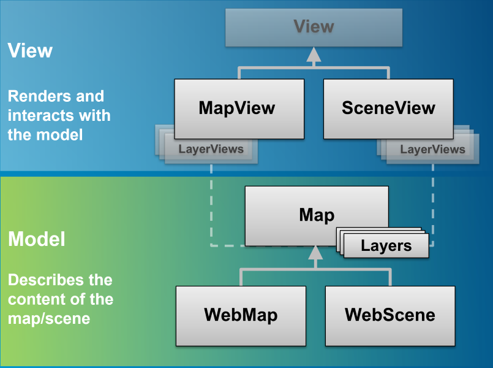
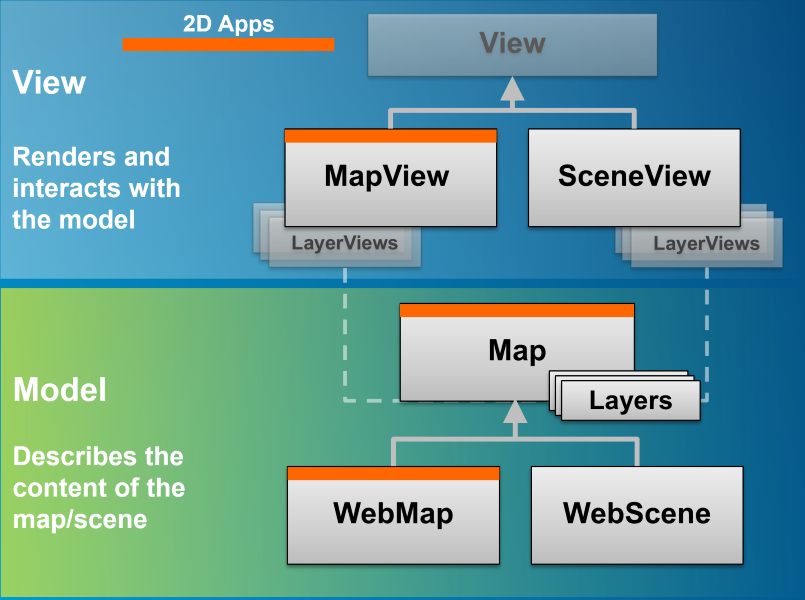

<!-- .slide: class="title" -->

## Introduction to the ArcGIS API for JavaScript

Berlin, 2017

---

<!-- .slide: class="agenda" -->

## Agenda

- Overview
- SDK
- API Fundamentals
- Map and View Architecture
- Layers and LayerViews
- Widgets and UI
- Features
- Scenes
- Portal API
- Visualizations/Arcade
- Accessor
- Widget Development

---

<!-- .slide: class="section" -->

# Overview

---

## Overview

- Introduction of 3D and WebScene
- New [WebScene Viewer](//www.arcgis.com/home/webscene/viewer.html) built with 4x
- New [SDK](//developers.arcgis.com/javascript/) rebuilt from scratch

---

## Overview

- New Portal API
- Better integration of `WebMap` and `WebScene`
 - Place the intelligence of the [arcgis.com map viewer](//www.arcgis.com/home/webmap/viewer.html) in the API
 - Addition of missing components like `GroupLayer`
 - Switching spatial reference
- APIs and Widgets redesign

---

## Overview

- Simplified API
- `WebMap` and `WebScene`, first class citizens
- brings 3D capabilities
- APIs and Widgets redesign
- Common patterns shared with Runtime SDKs

---

## Overview

- New architecture
- New development patterns
  - `Accessor`
  - `Collection`
  - `Promise`
- AMD only
- IE11+ and other modern browsers only
- _IE11 WebGL performance not optimal_

- Classes properly cased: `esri/Map`, `esri/Graphic`, `esri/layers/Layer`
- new folder structure.

---

# SDK
- Built from scratch
- Simpler, focused samples
- Enhanced user experience
- Improved search functionality
- More guides and code snippets
- [link](https://developers.arcgis.com/javascript/)

---

<!-- .slide: class="section" -->

# Exercise 1

---

<!-- .slide: class="section" -->

# API Fundamentals

---

## Core Classes

New core classes to get the job done
- `esri/core/Accessor`
- `esri/core/Promise`
- `esri/core/Collection`

---

## `esri/core/Accessor`

- base class of most of the API
- consistent pattern:
 - getting and setting properties value
 - watching properties change
- unifed object constructor
- computed properties
- autocast

---

## Accessor - Properties watching

- Direct benefits:
 - remove inconsistancies between constructor, getter, setter functions, events
 - one convention everywhere. _"just need to know what properties for a class"_
 - Single object constructor, no more 3+ constructors
 - Leaner SDK: we doc only the properties, the rest is convention

- Changes:
 - no more **_property_**-change events, use `watch()`
 - in 3.x, listen for [`extent-change`](https://developers.arcgis.com/javascript/3/jsapi/map-amd.html#event-extent-change) event.
 - in 4.x `extent` watchers will be called very often

---

## Accessor - Properties watching

```javascript
const map = new Map(...);
const view = new MapView({ map: map });

// watch for view scale updates
view.watch('scale', (newValue, oldValue, property, target) => {
  console.log(newValue, oldValue, property, target);
})

// chain watching
map.watch('basemap.title', (value) => {
  console.log(value);
});
map.basemap = 'topo';
```

---

- watchUtils

<iframe height='600' scrolling='no' title='watchUtils' src='//codepen.io/odoe/embed/preview/oeGmQN/?height=300&theme-id=31222&default-tab=js,result&embed-version=2' frameborder='no' allowtransparency='true' allowfullscreen='true' style='width: 100%;'>See the Pen <a href='https://codepen.io/odoe/pen/oeGmQN/'>watchUtils</a> by Rene Rubalcava (<a href='https://codepen.io/odoe'>@odoe</a>) on <a href='https://codepen.io'>CodePen</a>.
</iframe>

---

## Accessor - Unified Object Constructor

```js
require([
  'esri/Map',
  'esri/Basemap',
  'esri/core/Collection',
  'esri/layers/ArcGISTiledLayer'
],
function(
  Map,
  Basemap,
  Collection,
  ArcGISTiledLayer
) {
  const map = new Map({
    basemap: new Basemap({
      baseLayers: new Collection([
        new ArcGISTiledLayer(url)
      ])
    })
  });
});
```

---

## Accessor - Autocast

```js
require([
  'esri/Map',
  'esri/layers/ArcGISTiledLayer',
  'esri/views/MapView'
],
function(
  Map,
  ArcGISTiledLayer,
  MapView
) {
  const map = new Map({
    basemap: {
      baseLayers: [
        new ArcGISTiledLayer(url)
      ]
    }
  });

  const view = new MapView({
    map: map,
    container: 'viewDiv',

    extent: {
      xmin: -180, xmax: 180,
      ymin: -80, ymax: -80,
      spatialReference: 4326
    }
  });
});
```

---

## Accessor - Autocast

```js
  // 3.x
  new SimpleMarkerSymbol(SimpleMarkerSymbol.STYLE_SQUARE, 10,
    new SimpleLineSymbol(SimpleLineSymbol.STYLE_SOLID,
    new Color([255,0,0]), 4),
    new Color([255,255,255,0.25]));

  // 4.x
  {
    type: "simple",
    style: 'square',
    color: 'red',
    size: 10,

    outline: {
      color: 'rgba(255, 255, 255, 0.5)'
      width: 4
    }
  };
```

---

## Accessor - More Autocast

```js
const marker = {
  type: "simple-marker",
  style: 'square',
  color: 'red',
  size: 10,

  outline: {
    color: 'rgba(255, 255, 255, 0.5)'
    width: 4
  }
};

const pointGraphic = new Graphic({
  geometry: {
    type: "point", // autocasts as new Point()
    longitude: -71.2643,
    latitude: 42.0909
  },
  symbol: marker // autocasts as new SimpleMarkerSymbol()
});
```

---

## Accessor - Details

- Covered in more detail in a later section

---

## Collection

 - Array-_like_ Container
 - in house methods `add` / `remove` ...
 - array methods `forEach` / `map` ...
 - newer array methods `find` / `findIndex`...
 - used for layers, used for layers in Basemap, used for graphics...

```js
const collection = new Collection([1, 2, 3]);
collection.add(5);
collection.addMany([6, 7]);
collection.forEach((item) => {
  console.log(item);
});
const even = collection.filter((item) => {
  return (item % 2) === 0;
});
collection.forEach((item) => {
  console.log(item);
});
```

---

## Collection

 - Emit `"change"` events when something is added/removed/moved

```js
const collection = new Collection([1, 2, 3]);
collection.on("change", (event) => {
  console.log("added", event.added);
  console.log("moved", event.moved);
  console.log("removed", event.removed);
});
collection.add(5);
collection.addMany([6, 7]);
collection.shift();
collection.pop();
```

---

## Collection

 - Autocasting Support

```js
const PointCollection = Collection.ofType(Point);
const pointCollection = new PointCollection();

pointCollection.add([-100,40]);
pointCollection.add({ x: -100, y: 41 });


const point = pointCollection.getItemAt(0);
//point.x = -100; point.y = 40
```

---

## Promises

- All asynchronous methods return a promise, no more [events](https://developers.arcgis.com/javascript/jsapi/querytask-amd.html#events)
- The basic pattern looks like this:

```js
  someAsyncFunction()
    .then(resolvedVal => {
      //This is called when the promise resolves
      console.log(resolvedVal);  //logs the value the promise resolves to
    })
    .catch(error => {
      //This function is called when the promise is rejected
      console.error(error);  //logs the error message
    })
```

---

## Promises

- Classes may be Promise
 - Load resources
 - Asychronously initialized `Layer`, `WebMap`, `WebScene`, `View`
 - `view.then()` replaces `map.on('load', ...)`

```js
const map = new Map({...})

view = new SceneView({
  map: map,
  //...
});

view.then(() => {
  // the view is ready to go
});
```

---

## Promises

```js
view.then(() => {
  return view.whenLayerView(map.findLayerById("awesomeLayer"));
})
.then(layerView => {
  return watchUtils.whenFalseOnce(layerView, "updating");
})
.then(({ target: layerView })=> {
  return layerView.queryFeatures();
})
.then(doSomethingWithFeatures)
.catch(errorHandler);
```

---

## Loadables

- brings better control, and scheduling of loading resources.
- extension of `esri/core/Promise`
- in 3.x, instanciating a layer loads it. in 4.x, it's an explicit call
- the views automatically loads the map and its layers

---

## Loadables

- `WebMap` / `WebScene` need to load:
 - the portal item
 - the layer module
 - the layer's item
- `MapView` / `SceneView` need to load:
 - the map
 - the layers

---

In a single page application, get a feature from a FeatureLayer from a WebMap without displaying it, ASAP!

```js
  const webmap = new WebMap({
    portalItem: {
      id: 'affa021c51944b5694132b2d61fe1057'
    }
  });

  webmap.load()
    .then(() => {
      return webmap.getLayer('myFeatureLayerId').load();
    })
    .then(featureLayer => {
      return featureLayer.queryFeatures({
        where: 'OBJECTID = 1'
      });
    })
    .then(({ features }) => {
      displayDetails(features[0]);
    })
    .catch(error => {
      console.error(error);
    });
```

---

<!-- .slide: class="section" -->

# Exercise 2

---

<!-- .slide: class="section" -->

# Map and View architecture

---


## Map and View architecture

- One of the starting point of 4: bring 3D
- Completely different rendering system
- Isolate the 2D rendering from the 3D one

---

## Map and View architecture


---

## Map and View architecture



---

## Map and View architecture



---

## MapView and SceneView - multiple views

```js
  const map = new Map({
    basemap: 'topo',
    layers: [
      new ArcGISDynamicLayer(...)
    ]
  });

  const mapView = new MapView({
    map: map,
    container: 'mapDiv'
  });

  const sceneView = new SceneView({
    map: map,
    container: 'sceneDiv'
  });
```

---

## WebMaps

- Create directly from a WebMap id
- Using new `WebMap` module

---

## WebMaps

```js
const webmap = new WebMap({
  portalItem: {
    id: "2dfaf8bdb45a4dcf8511a849e4583873"
  }
});

const view = new MapView({
  map: webmap,
  container: "viewDiv"
});
```

---

## WebMaps

- Maps are just containers of data
- No display capabilities
- Can load data before it is displayed
- Can have multiple WebMaps, lazy-load as needed

---

## WebMaps

```javascript
const webmap = new WebMap({
  portalItem: {
    id: "f2e9b762544945f390ca4ac3671cfa72"
  }
});

webmap.load().then(function() {
  const layer = webmap.layers.find(x => {
    return x.id.indexOf("Accidental_Deaths") > -1;
  });
  layer.definitionExpression = "Population > 10000"
  const view = new MapView({
    map: webmap,
    container: "viewDiv"
  });
});
```

- [Demo](http://jsbin.com/lodihu/6/edit?html,output)

---

## WebMaps

```javascript
const webmapids = [
  "e691172598f04ea8881cd2a4adaa45ba",
  "f2e9b762544945f390ca4ac3671cfa72"
];

// create an array of WebMaps
const webmaps = webmapids.map(webmapid =>  {
  return new WebMap({
    portalItem: {
      id: webmapid
    }
  });
});
```

- [Demo](https://developers.arcgis.com/javascript/latest/sample-code/sandbox/sandbox.html?sample=webmap-switch)

---

## WebMap and WebScene

- `WebMap` is the document of a 2D Map
- `WebScene` is the document of a 3D Map
- extend common `Map` class
- first class citizens of the API
- can be consumed by apps accross the platform

---

## WebMap and WebScene

- full `WebScene` support
- `WebMap` support for key layers
 - degrade non yet supported layers as `UnsupportedLayer`
 - full support planned for end 2016
- writing under-development

---

## WebMap and WebScene

- similarities
 - `basemap`
 - operational data: `layers`
- specialities
 - environment, ground, SceneLayer
 - different type of presentations
 - more...

---

## WebMap and WebScene

```js
const webmap = new WebMap({
  portalItem: {
    id: 'e691172598f04ea8881cd2a4adaa45ba'
  }
});
```
[demo](https://developers.arcgis.com/javascript/latest/sample-code/sandbox/sandbox.html?sample=webmap-basic)

```js
const webscene = new WebScene({
  portalItem: {
    id: '19dcff93eeb64f208d09d328656dd492'
  }
});
```
[demo](https://developers.arcgis.com/javascript/latest/sample-code/sandbox/sandbox.html?sample=webscene-basic)

---

## WebScene specific - `slides`

- created with the webscene viewer
- store layers visibility, camera, environment

```js
// slides from webscene's presentation
const slides = scene.presentation.slides;

// create a clickable thumbnails
slides.forEach(slide =>  {
  const thumb = new Slide({
    slide: slide
  });
  thumb.on('click', () => {
    // apply the slide on the view
    slide.applyTo(view);
  });
  slidesDiv.appendChild(thumb.domNode);
});

```

---

## WebScene specificities - `viewingMode`

- visualize `global` or `local` scenes
- `local` scenes are best for projected data and underground display

```js
const view = new SceneView({
  
  viewingMode: 'local',

  clippingArea: {
    xmin: ...
    ymin: ...
    xmin: ...
    ymin: ...
    spatialReference: ...
  },

  map: new WebScene(...)
});

```

- [demo](https://developers.arcgis.com/javascript/latest/sample-code/sandbox/sandbox.html?sample=scene-local)

---

## WebMaps

- The WebMap contains layers and/or item ids
- Unsupported layers defined as `UnsupportedLayer`
- Undetermined layers loaded as `UnknownLayer`

---

# Exercise 3

---

# Layers and LayerViews

---

## Layers

- `map.layers` contains operational layers
- `map.allLayers` contains all layers including basemaps
- Similar to `Map` and `View`, `Layer` contains features and how to draw, but rendered with `LayerView`

---

## GraphicsLayer

- Simplest layer to work with
- A "bag-o-graphics"
- Does not support renderers

---

## GraphicsLayer

```js
const graphicsLayer = new GraphicsLayer({
  graphics: [graphic1, graphic2, graphic3]
});

// add a single graphic
graphicsLayer.add(graphic4);
// add an array of graphics
graphicsLayer.addMany([graphic5, graphic6, graphic7]);
```

---

## GraphicsLayer - create a Graphic

```js
const graphic = new Graphic({
  attributes: {
    id: 1,
    city: "Los Angeles"
  },
  geometry: {
    type: "point",
    x: xValue,
    y: yValue
  },
  symbol: {
    type: 'simple-marker',
    style: 'circle',
    color: 'red',
    size: 10,
    outline: {
      color: 'rgba(255, 255, 255, 0.5)'
      width: 4
    }
  },
  popupTemplate: {
    title: "My Awesome Graphic!",
    content: "{*}" // display all fields
  }
});
// add it to graphicsLayer
graphicsLayer.add(graphic);
```

---

## FeatureLayer

- Versatile and widely used in ArcGIS Platform
- Supports renderers
- Can be queried

---

## FeatureLayer

```javascript
// Create via URL
const featureLayer = new FeatureLayer({
  url: "http://services6.arcgis.com/m3L8QUZ93HeaQzKv/arcgis/rest/services/BeerAndBurgerJoints/FeatureServer/0"
});
// Create via a Portal item
const featureLayer = new FeatureLayer({
  portalItem: {
    id: "b126510e440744169943fd8ccc9b0c4e"
  }
});
```

---

## FeatureLayer - FeatureCollection

```javascript
const featureLayer = new FeatureLayer({
  objectIdField: "item_id",
  geometryType: "point",
  // Define the fields of the graphics in the FeatureLayer
  fields: [{
    name: "item_id",
    alias: "Item ID",
    type: "oid"
  }, {
    name: "description",
    alias: "Description",
    type: "string"
  }, {
    name: "title",
    alias: "Title",
    type: "string"
  }],
  // Define a renderer for the layer
  renderer: {
    type: "simple",
    symbol: {
      type: 'simple-marker',
      style: 'circle',
      color: 'red',
      size: 10,
      outline: {
        color: 'rgba(255, 255, 255, 0.5)'
        width: 4
      }
    }
  },
  popupTemplate: {
    title: "{title}",
    content: "{description}"
  },
  // This is a collection of Graphics
  source: [graphic1, graphic2, graphic3]
});
```

---

## FeatureLayer - Update Graphics

```js
const graphicOfInterest = featureLayer.source.find(x => {
  return x.attributes.OBJECTID === oid;
});
const target = graphicOfInterest.clone();
const target.geometry = updatedGeometry;
featureLayer.source.remove(graphicOfInterest);
featureLayer.source.add(target);
```

---

## FeatureLayer - Current Limitations

- No editing support
- Drawing pipeline not optimized (no modes)
- No draw tools

---

## CSVLayer

- CSV is a popular data exchange format
- Only for points
- Can use renderers

---

## CSVLayer

```js
const url = "http://earthquake.usgs.gov/earthquakes/feed/v1.0/summary/2.5_week.csv";
urlUtils.addProxyRule({
 urlPrefix: "earthquake.usgs.gov",
 proxyUrl: "/proxy/proxy.php"
});

const csvLayer = new CSVLayer({
 url: url,
 copyright: "USGS Earthquakes"
});
map.add(csvLayer);
```

---

## GroupLayer

- Ability to organize layers
- Can customize layer visibility

---

## GroupLayer

<iframe height='600' scrolling='no' title='WatLayers' src='//codepen.io/odoe/embed/preview/JrdXqe/?height=300&theme-id=31222&default-tab=js,result&embed-version=2' frameborder='no' allowtransparency='true' allowfullscreen='true' style='width: 100%;'>See the Pen <a href='https://codepen.io/odoe/pen/JrdXqe/'>WatLayers</a> by Rene Rubalcava (<a href='https://codepen.io/odoe'>@odoe</a>) on <a href='https://codepen.io'>CodePen</a>.
</iframe>

---

## ImageryLayer

- For displaying Image Services
- Support for [pixel filtering](https://developers.arcgis.com/javascript/latest/api-reference/esri-layers-ImageryLayer.html#pixelFilter), [rendering rules](https://developers.arcgis.com/javascript/latest/api-reference/esri-layers-ImageryLayer.html#renderingRule), and [mosaic rules](https://developers.arcgis.com/javascript/latest/api-reference/esri-layers-ImageryLayer.html#mosaicRule)

---

## ImageryLayer - Simple

```js
const layer = new ImageryLayer({
  url: "https://sampleserver6.arcgisonline.com/arcgis/rest/services/NLCDLandCover2001/ImageServer",
  format: "jpgpng" // server exports in either jpg or png format
});
```

---

## ImageryLayer - Pixel Filter

```js
function colorize(pixelData) {
  if (pixelData === null || pixelData.pixelBlock === null ||
    pixelData.pixelBlock.pixels === null) {
    return;
  }
  // The pixelBlock stores the values of all pixels visible in the view
  pixelBlock = pixelData.pixelBlock;
  // Get the min and max values of the data in the current view
  minValue = pixelBlock.statistics[0].minValue;
  maxValue = pixelBlock.statistics[0].maxValue;
  // The pixels visible in the view
  const pixels = pixelBlock.pixels;
  // The number of pixels in the pixelBlock
  const numPixels = pixelBlock.width * pixelBlock.height;
  // Calculate the factor by which to determine the red and blue
  // values in the colorized version of the layer
  factor = 255.0 / (maxValue - minValue);
  // Get the pixels containing temperature values in the only band of the data
  const tempBand = pixels[0];
  // Create empty arrays for each of the RGB bands to set on the pixelBlock
  const rBand = [];
  const gBand = [];
  const bBand = [];
  // Loop through all the pixels in the view
  for (i = 0; i < numPixels; i++) {
    // Get the pixel value (the temperature) recorded at the pixel location
    const tempValue = tempBand[i];
    // Calculate the red value based on the factor
    const red = (tempValue - minValue) * factor;
    // Sets a color between blue (coldest) and red (warmest) in each band
    rBand[i] = red;
    gBand[i] = 0;
    bBand[i] = 255 - red;
  }
  // Set the new pixel values on the pixelBlock
  pixelData.pixelBlock.pixels = [rBand, gBand, bBand];
  pixelData.pixelBlock.pixelType = "U8"; // U8 is used for color
}
```

---

## ImageryLayer - Mosaic Rule & Rendering Function

```js
const rf = new RasterFunction({
  functionName: "None" // let's us access temperature value per pixel
});

const dimInfo = []; // Define dimensional definition as array

// Multidimensional information of image service can be viewed at thisService/multiDimensionalInfo
// DEPTH: show only temperatures at sea surface
dimInfo.push(new DimensionalDefinition({
  variableName: "water_temp",
  dimensionName: "StdZ", // Water depth
  values: [0], // Sea surface or 0ft
  isSlice: true
}));
// TIME: only show temperatures for the week of April 7, 2014
dimInfo.push(new DimensionalDefinition({
  variableName: "water_temp",
  dimensionName: "StdTime", // time temp was recorded
  values: [1396828800000], // Week of April 7, 2014
  isSlice: true
}));

const mr = new MosaicRule({
  multidimensionalDefinition: dimInfo
});
```

---

## ImageryLayer - Put it together

```js
const layer = new ImageryLayer({
  url: url,
  renderingRule: rf,
  pixelFilter: colorize,
  mosaicRule: mr,
  // The popup will display the temperature at the clicked location
  popupTemplate: {
    title: "Sea Surface Temperature",
    content: "{Raster.ServicePixelValue}° Celsius"
  }
});
```

---

## MapImageLayer

- Display layers and sublayers from Map Services
- Map Service can export map image given a bounding box
- Simplified API for dynamic layer infos
  - sublayers

---

## MapImageLayer

```javascript
const layer = new MapImageLayer({
  url: "https://sampleserver6.arcgisonline.com/arcgis/rest/services/USA/MapServer",
  sublayers: [
  {
    id: 0,
    visible: true
  },
  {
    id: 1,
    visible: true
  },
  {
    id: 2,
    visible: true,
    definitionExpression: "pop2000 > 1000000"
  },
  {
    id: 3,
    visible: false
  }]
});
```

---

## MapImageLayer

<iframe height='600' scrolling='no' title='4.5 - MapImageLayer' src='//codepen.io/odoe/embed/preview/eGVeWY/?height=300&theme-id=31222&default-tab=js,result&embed-version=2' frameborder='no' allowtransparency='true' allowfullscreen='true' style='width: 100%;'>See the Pen <a href='https://codepen.io/odoe/pen/eGVeWY/'>4.5 - MapImageLayer</a> by Rene Rubalcava (<a href='https://codepen.io/odoe'>@odoe</a>) on <a href='https://codepen.io'>CodePen</a>.
</iframe>

---

## MapImageLayer

- Increibly powerful and flexible
- Simplified API makes it easy to use
- Fast for large datasets

---

## TileLayer

- For _cached_ map services
- Faster than `MapImageLayer`
- Not dynamic

---

## TileLayer

```js
const transportationLyr = new TileLayer({
  url: "https://server.arcgisonline.com/ArcGIS/rest/services/Reference/World_Transportation/MapServer",
  id: "streets",
  visible: false
});
```

---

## StreamLayer

- For GeoEvent ArcGIS Server Extension
- Uses WebSockets to stream data
- Real-time

---

## StreamLayer

- `purgeOptions` limit features to specific count or age

```js
const streamLayer = new StreamLayer({
  url: "https://geoeventsample3.esri.com:6080/arcgis/rest/services/SeattleBus/StreamServer",
  purgeOptions: {
    displayCount: 1000
  }
});
```

---

## WebTileLayer

- For use with _non-ArcGIS_ Server map tiles
- Define the `level`, `column`, and `row` for map tiles

---

## WebTileLayer

```js
const tiledLayer = new WebTileLayer({
  urlTemplate: "http://{subDomain}.tile.stamen.com/toner/{level}/{col}/{row}.png",
  subDomains: ["a", "b", "c", "d"],
  copyright: "Map tiles by <a href=\"http://stamen.com/\">Stamen Design</a>, " +
    "under <a href=\"http://creativecommons.org/licenses/by/3.0\">CC BY 3.0</a>. " +
    "Data by <a href=\"http://openstreetmap.org/\">OpenStreetMap</a>, " +
    "under <a href=\"http://creativecommons.org/licenses/by-sa/3.0\">CC BY SA</a>."
});
```

---

## VectorTileLayer

- Similar to `WebTileLayer`, but with vector data, not raster data
- Served in `.pbf` format
- Three parts
  - tiles
  - style file
  - index file

---

## VectorTileLayer

- Style file contains URL info for tiles, sprites, and glyphs

```js
const vtlLayer = new VectorTileLayer({
  // URL to the style of vector tiles
  url: "https://www.arcgis.com/sharing/rest/content/items/bf79e422e9454565ae0cbe9553cf6471/resources/styles/root.json"
});
```

---

## OpenStreetMapLayer

- Easy way to use OpenStreetMap data in maps

```js
// add servers to corsEnabledServers
esriConfig.request.corsEnabledServers.push("a.tile.openstreetmap.org",
        "b.tile.openstreetmap.org", "c.tile.openstreetmap.org");
const osmLayer = new OpenStreetMapLayer();
```

---

## LayerViews

- `LayerViews` renders the layers on the view.
- [LayerView](https://developers.arcgis.com/javascript/latest/api-reference/esri-views-layers-LayerView.html) has limited API so far.
- give info about layer rendering
 - 3.x: `Layer.suspended` now `LayerView.suspended` 
- will give access to data displayed on the screen
 - Features
 - Elevation data
- ability to override properties from the layer
 - visibility
 - renderer
 - ...

---

## LayerViews

- access a layerview with [`View.whenLayerView()`](https://developers.arcgis.com/javascript/latest/api-reference/esri-views-View.html#whenLayerView) 

```js
  const map = new Map({
    basemap: 'topo'
  });
  const mapView = new MapView({
    map: map,
    container: 'mapDiv'
  });

  const layer = new FeatureLayer(...)
  map.add(layer);

  view.whenLayerView(layer)
    .then(layerView => {
      layerView.visible = false
    });
```
- or [`View.allLayerViews`](https://developers.arcgis.com/javascript/latest/api-reference/esri-views-View.html#allLayerViews) 

---

## LayerViews

- FeatureLayer and LayerViews can be queried
- `featureLayer.queryFeatures()` - query features on the service
- `featureLayerView.queryFeatures()` - query features displayed in the view

---

## LayerViews

```js
view.whenLayerView(fLayer)
.then(function(layerView) {
  const query = new Query();
  query.geometry = view.extent;
  layerView.queryFeatures(q).then(features => {
    // do something with features
  });
});
```

---

<!-- .slide: class="section" -->

# Exercise 4

[http://jsbin.com/perovey/edit?html,css,js,output]: #

---

<!-- .slide: class="section" -->

# Widgets and UI

---

## Widgets

- [Out of the box widgets at 4.x](https://developers.arcgis.com/javascript/latest/sample-code/get-started-widgets/index.html):
 - Zoom
 - Attribution
 - Compass
 - Home
 - Locate
 - Search
 - Legend
 - Popup
   - [dockable](https://developers.arcgis.com/javascript/latest/sample-code/sandbox/sandbox.html?sample=popup-docking-position)
   - [custom actions](https://developers.arcgis.com/javascript/latest/sample-code/sandbox/sandbox.html?sample=popup-custom-action)
- New design and user experience

---

## Widgets

- Extensibility through:
 - [CSS](https://developers.arcgis.com/javascript/latest/sample-code/styling-simple-theme/index.html), [matching vectortiles](https://ycabon.github.io/presentations/2016-devsummit-discover-4.0-the-next-generation/demos/css-vectortiles/index.html)
 - SASS
 - View Model

---

## Widgets - View Model

- New architecture
- Logic of the widget separated from the representation
- View implementations made in dijit/Accessor
- Views' source code available in the [SDK](https://developers.arcgis.com/javascript/latest/api-reference/esri-widgets-Zoom.html)
- View's can be rewritten in [any framework](demos/widgets/framework/index.html)
- ViewModels can be combined to create [Frankenwidgets](demos/widgets/frankenwidget/index.html)

---

## UI

- Managed overlay to place widgets over the view.
- Well known widgets can be directly added or removed from the view
- Popups are responsive

```js
const view = new MapView({

  ui: {

    padding: {
      top: 16,
      left: 16,
      right: 16,
      bottom: 16
    },

    components: ["zoom", "compass", "attribution"]

  }

});
```

---

## UI

- API to add widgets or any DOM element to the 4 corners of the view

```js
const view = new MapView({
  //...
});

const legend = new Legend({
  //...
});

view.ui.add(legend, "top-left");
```

---

## Popups

- First entry point to detailed data

```js
// basic popup
const featureLayer = new FeatureLayer({
  url: "https://sampleserver6.arcgisonline.com/arcgis/rest/services/Census/MapServer/3",
  outFields: ["*"],
  popupTemplate: {
    title: "Name: {STATE_NAME}",
    content: "{*}"
  }
});
```

---

## Popups - Fields and Aliases

- First entry point to detailed data

```js
content: [
  {
    type: "fields",
    fieldInfos: [
      {
        fieldName: "POP2000",
        visible: true,
        label: "Population for year 2000",
        format: {
          places: 0,
          digitSeparator: true
        }
      },
      {
        fieldName: "POP2007",
        visible: true,
        label: "Population for year 2007",
        format: {
          places: 0,
          digitSeparator: true
        }
      }  
    ]
  }
]
```

---

## Popups - Fields and Aliases

- Format dates

```js
{
  fieldName: "FAKEDATE",
  visible: true,
  label: "Fake Date Field",
  format: {
    dateFormat: "short-date"
  }
}
```

---

## Popups - Fields and Aliases

- Custom content

```js
const featureLayer = new FeatureLayer({
  url: "https://sampleserver6.arcgisonline.com/arcgis/rest/services/Census/MapServer/2",
  outFields: ["*"],
  popupTemplate: {
    title: "Name: {STATE_NAME}",
    content: `
      <section>
        <h4>{STATE_ABBR}</h4>
        <hr />
        <ul>
          <li>Year 2000 Pop: {POP2000}</li>
          <li>Year 2007 Pop: {POP2007}</li>
          <li>Total Households: {HOUSEHOLDS}</li>
        </ul>
      </section>
    `
  }
});
```

---

## Popups - MediaInfos

- Charts

```js
{
  type: "media",
  mediaInfos: [
    {
      title: "<b>Population</b>",
      type: "column-chart",
      caption: "",
      value: {
        theme: "BlueDusk",
        fields: [ "POP2000", "POP2007" ]
      }
    }
  ]
}
```

---

## Popups - Custom actions

```js
// PopupTemplate
{
  title: '{Name}',
  content: '{*}',
  actions: [{
      id: 'alcohol-details',
      className: 'esri-icon-description',
      title: 'Events'
  }]
}
```

---

## Popups - Custom actions

```js
view.popup.viewModel.on("trigger-action", function(event) {
  const action = event.action;
  if (action.id === "customer-details") {
    const attributes = view.popup.viewModel.selectedFeature.attributes;
    const customerGroup = attributes.CUSTOMER_GROUP;
    esriRequest(customAPIURL, {
      query: {
        group: customerGroup
      },
      responseType: "json"
    })
    .then(function(response ) {
      // parse response data and update popup content
    })
    .otherwise(function() {
      console.log(error);
    });
  }
});
```

---

<!-- .slide: class="section" -->

# Features

---

## Features

- `Basemap`
- Animation
- Environment

---

## Basemap

- full fledge class `esri/Basemap`
- basemap's layers are _not_ part of the `map.layers`, but from `map.basemap`
- contains 2 Collections: `baseLayers`, `referenceLayers`
- can be set with
  - string for esri's basemap
  - or custom Basemap instance
  - in 2D and 3D

---

## Basemap

- `basemap` as a string, creation of the appropriated Basemap instance

```js
const map = new Map({
  basemap: 'topo'
});

map.basemap = 'streets';
```

- `basemap` as an instance of `Basemap`

```js
const map = new Map({/*...*/});

const toner = {
  baseLayers: [
    new WebTiledLayer({
      urlTemplate: '...'
    })
  ]
};

map.basemap = toner;
```

---

<!-- .slide: class="section" -->

# Exercise 5

---

<!-- .slide: class="section" -->

# Scenes

---

## WebScenes

- [Author and Publish Scenes in Pro](http://pro.arcgis.com/en/pro-app/help/mapping/map-authoring/author-a-web-scene.htm)
- Modify Publish Scenes in [SceneViewer](https://www.arcgis.com/home/webscene/viewer.html)

---

## WebScenes

```js
const scene = new WebScene({
  portalItem: {
    id: "082c4fd545104f159db39da11ea1e675"
  }
});

const view = new SceneView({
  map: scene,
  container: "viewDiv"
});
```

---

## SceneView

- Render Scenes
- [Camera](https://developers.arcgis.com/javascript/latest/api-reference/esri-views-SceneView.html#camera)
- [Environment](https://developers.arcgis.com/javascript/latest/api-reference/esri-views-SceneView.html#environment)

---

## Camera

- Specific location (x, y z)
- Pointed in a specific direction
- Tilted at a specific angle
- Specific field of view

---

## Camera

```js
const view = new SceneView({
  map,
  container: "viewDiv",
  camera: {
    position: [7.654, 45.919, 5183],
    tilt: 80
  }
});
// some point in your application, you can update the camera.
view.goTo({
  position: [7.654, 45.919, 7500],
  tilt: 65
});
```

- [demo](https://jsbin.com/sodeda/3)

---

## Camera

- update camera

```js
const camera = view.camera.clone();
camera.tilt = 120;
view.camera = camera;
// or
view.gotTo(camera);
```

---

## Environment

- defines light characteristics
- stars!

```js
sceneView.environment = {
  atmosphere: {
    quality: 'high'
  },

  starsEnabled: true,

  lighting: {
    directShadowsEnabled: true,
    ambientOcclusionEnabled: true,

    // The time and date for which
    // the sun position and light direction is computed.
    date: new Date("Mon Mar 07 2016")
  }
};
```

- [demo](https://developers.arcgis.com/javascript/latest/sample-code/sandbox/sandbox.html?sample=sceneview-stars)

---

<!-- .slide: class="section" -->

# Portal API

---

## Portal API

- [redesigned API](https://developers.arcgis.com/javascript/latest/api-reference/esri-portal-Portal.html)
- access portal information: basemaps, featuring content
- query items, users, groups
- loading items like layers, webmap and webscene
- creating, deleting and updating items

---

## Portal API

```js
const portal = new Portal();

// Setting authMode to immediate signs the user in once loaded
portal.authMode = 'immediate';

// Once loaded, user is signed in
portal.load()
  .then(() => {
    // Create query parameters for the portal search
    const queryParams = new PortalQueryParams({
      query: 'owner:' + portal.user.username,
      sortField: 'numViews',
      sortOrder: 'desc',
      num: 20
    });

    // Query the items based on the queryParams created from portal above
    portal.queryItems(queryParams).then(createGallery);
  });
```

- [demo](https://developers.arcgis.com/javascript/latest/sample-code/sandbox/sandbox.html?sample=portalitem-dragndrop)

---

## Portal API

```js
const promise = Layer.fromPortalItem({
  portalItem: {
    id: '8444e275037549c1acab02d2626daaee',
    portal: {
      url: 'https://myorg.maps.argis.com'
    }
  }
})
.then(layer => {
  // Adds the layer to the map once it loads
  map.add(layer);
})
.otherwise(error => {
  //handle the error
});
```

- [demo](https://developers.arcgis.com/javascript/latest/sample-code/sandbox/sandbox.html?sample=layers-portal)


---

<!-- .slide: class="section" -->

# Visualizations

---

## Basic Visualizations

- `SimpleRenderer` for basic visualizations

```js
const citiesRenderer = {
  type: "simple",
  symbol: {
    type: "simple",
    size: 10,
    color: "#FF4000",
    outline: {
      color: [255, 64, 0, 0.4],
      width: 7
    }
  })
};
```

---

## Visual Variables

```js
const renderer = {
  type: "simple",
  symbol: { ... },
  label: "tree",
  visualVariables: [{
    type: "size",
    field: "Width_EW",
    valueUnit: "feet",
    valueRepresentation: "diameter"
  }, {
    type: "color",
    field: "C_Storage", // Carbon storage
    stops: [
        {
          value: 0,
          color: "#f7fcb9"
        }, // features with zero carbon
        {
          value: 8000,
          color: "#31a354"
        } // features with 8000 carbon
      ]
      // Values between 0-8000 will be assigned a color proportionally along the ramp
  }]
});
```

---

## Realistic 3D Symbols

```js
const renderer = {
  type: "simple",
  symbol: {
    type: "point-3d",
    symbolLayers: [{
        type: "icon",
        outline: {
            size: 2
        },
        material: {
            color: [255, 255, 0, 1]
        }
    }]
  },
  visualVariables: [
  {
    type: "size",
    axis: "height",
    field: "Height", // tree height
    valueUnit: "feet"
  }, {
    type: "size",
    axis: "width",
    field: "Width_EW", // crown diameter from east to west
    valueUnit: "feet"
  }, {
    type: "size",
    axis: "depth",
    field: "Width_NS", // crown diameter from north to south
    valueUnit: "feet"
  }, {
    type: "color",
    field: "C_Storage", // Carbon storage
    stops: [
      {
        value: 0,
        color: "#f7fcb9"
      }, // features with zero carbon
      {
        value: 10000,
        color: "#31a354"
      } // features with 800 carbon
    ]
  }]
};
```

---

## Data-driven rotation

```js
const rotRenderer = {
  type: "simple",
  symbol: picSym,
  visualVariables: [{
    type: "rotation",
    field: "grid_code",
    rotationType: "geographic"
  }]
};
```

---

## Visualize by Type

```js
const hwyRenderer = {
  type: "unique-value",
  defaultSymbol: otherSym,
  defaultLabel: "Other major roads",
  field: "CLASS",
  uniqueValueInfos: [
  {
    value: "I", // code for interstates/freeways
    symbol: fwySym,
    label: "Interstate"
  }, {
    value: "U", // code for U.S. highways
    symbol: hwySym,
    label: "US Highway"
  }]
};
```

---

## 3D Extrusion

```js
const renderer = {
  type: "unique-value",
  defaultSymbol: {
    type: "point-3d",
    symbolLayers: [{
        type: "icon",
        outline: {
            size: 2
        },
        material: {
            color: [255, 255, 0, 1]
        }
    }]
  },
  defaultLabel: "Other",
  field: "DESCLU",
  uniqueValueInfos: [
  {
    value: "Residential",
    symbol: resSym,
    label: "Residential"
  }, {
    value: "Residential Condominium",
    symbol: condoSym,
    label: "Condominium"
  }],
  visualVariables: [{
    type: "size",
    field: "ELEVATION",
    valueUnit: "feet"
  }]
});
```

---

## Thematic

```js
const renderer = {
  type: "class-breaks",
  field: "COL_DEG",
  normalizationField: "EDUCBASECY",
  defaultSymbol: { ... },
  defaultLabel: "no data",
  classBreakInfos: [
  {
    minValue: 0,
    maxValue: 0.3499,
    symbol: less35,
    label: "< 35%"
  }, {
    minValue: 0.35,
    maxValue: 0.4999,
    symbol: less50,
    label: "35 - 50%"
  }, {
    minValue: 0.50,
    maxValue: 0.7499,
    symbol: more50,
    label: "50 - 75%"
  }, {
    minValue: 0.75,
    maxValue: 1.00,
    symbol: more75,
    label: "> 75%"
  }]
};
```

---

## Data-driven continous color

```js
const renderer = {
  type: "simple",
  symbol: defaultSym,
  label: "% population in poverty by county",
  visualVariables: [{
    type: "color",
    field: "POP_POVERTY",
    normalizationField: "TOTPOP_CY",
    stops: [
    {
      value: 0.1,
      color: "#FFFCD4",
      label: "<10%"
    },
    {
      value: 0.3,
      color: "#350242",
      label: ">30%"
    }]
  }]
};
```

---

## Data-driven continous size

```js
const renderer = {
  type: "simple",
  symbol: defaultSym,
  label: "% population in poverty by county",
  visualVariables: [{
    type: "size",
    field: "POP_POVERTY",
    normalizationField: "TOTPOP_CY",
    stops: [
    {
      value: 0.15,
      size: 4,
      label: "<15%"
    },
    {
      value: 0.25,
      size: 12,
      label: "25%"
    },
    {
      value: 0.35,
      size: 24,
      label: ">35%"
    }]
  }]
};
```

---

## Data-driven extrusion

```js
const renderer = {
  type: "simple",
  symbol: {
    type: "point-3d",
    symbolLayers: [{
        type: "icon",
        outline: {
            size: 2
        },
        material: {
            color: [255, 255, 0, 1]
        }
    }]
  },
  label: "% population in poverty by county",
  visualVariables: [{
    type: "size",
    field: "POP_POVERTY",
    normalizationField: "TOTPOP_CY",
    stops: [
    {
      value: 0.10,
      size: 10000,
      label: "<10%"
    },
    {
      value: 0.50,
      size: 500000,
      label: ">50%"
    }]
  }, {
    type: "color",
    field: "POP_POVERTY",
    normalizationField: "TOTPOP_CY",
    stops: [
    {
      value: 0.10,
      color: "#FFFCD4",
      label: "<15%"
    },
    {
      value: 0.35,
      color: [153, 83, 41],
      label: ">35%"
    }]
  }]
};
```

---

## Data-driven opacity

```js
const renderer = {
  type: "simple",
  symbol: defaultSym,
  label: "Educational Attainment",
  visualVariables: [{
    type: "opacity",
    field: "EDUCBASECY",
    stops: [
    {
      value: 700,
      opacity: 0.1
    },
    {
      value: 1500,
      opacity: 0.9
    }]
  }]
};
```

---

## Thematic multivariate visualization

```js
const colorVisconst = {
  type: "color",
  field: "MP27002a_B",
  normalizationField: "TOTPOP_CY",
  stops: [
  {
    value: 0.33,
    color: "#FFFCD4"
  },
  {
    value: 0.53,
    color: "#0D2644"
  }]
};
const sizeVisconst = {
  type: "size",
  field: "TOTPOP_CY",
  normalizationField: "SQMI",
  valueUnit: "unknown",
  stops: [
  {
    value: 4000,
    size: 6
  },
  {
    value: 23000,
    size: 40
  }]
};
```

---

<!-- .slide: class="section" -->

# Exercise 6

---

<!-- .slide: class="section" -->

# Accessor

- What is Accessor?
- How does it work?
- Public API
- Implement `Accessor`
- TypeScript integration

---

# What is Accessor?

---

### What is Accessor?

- When we started 4.0 we looked at how 3.x was built.
- Improve on the experience
- Instead of building great apps with new features, deal with the API.
- We identified major coding pattern that could be formalized.

---

### What is Accessor?

- Objects are composed of properties that can be
  - read and set
  - or read-only
  - Constructor arguments
  - Computed from other properties
  - Events were emitted when changed
- Objects represent remote resources initialized from JSON objects
- Objects can be asynchronously initialized like layers  
  "do not override properties set by the user" 
  - Remote resources from different origins: service, portal item, portal document


---

### How does it work?

based on ES5 accessors

```js
const Person = function() {}

Object.defineProperty(Person.prototype, "firstName", {
  get: function() {
    return this._firstName;
  }
});
```

---

# Public API

---

### Public API - unified single object constructor

Creating an instance, unified single object constructor.

```ts
let layer: TileLayer = new TileLayer({
  url: "http://...",
  opacity: 0.5
});

let mapView: MapView = new MapView({
  map: new Map({
    layers: new Collection([
      layer
    ])
  }),
  container: "viewDiv"
});
```

---

### Public API - property access

Accessing property values

```ts
console.log(layer.opacity);
console.log(layer.title);

layer.opacity = 0.5;
layer.title = "My test layer";

// setting multiple values
layer.set({
  opacity: 0.5,
  title: "My test layer"
});

// accessing the value of a deep property
view.get("map.basemap.title");
view.set("map.basemap.title", "new title");
```

---

### Public API - property watching

Watching for property changes

```ts
mapView.watch("scale", (newValue, oldValue, property, target) => {
  console.log(`scale changed: ${newValue}`);
});


mapView.watch("map.basemap.title", (newValue, oldValue, property, target) => {
  console.log(`new basemap title: ${newValue}`);
});


mapView.watch("ready, stationary", (newValue, oldValue, property, target) => {
  console.log(`property ${property}: ${newValue}`);
});
```

---

### Public API - autocasting

```js
  // 3.x
  new SimpleMarkerSymbol(SimpleMarkerSymbol.STYLE_SQUARE, 10,
    new SimpleLineSymbol(SimpleLineSymbol.STYLE_SOLID,
    new Color([255,0,0]), 4),
    new Color([255,255,255,0.25]));

  // 4.x
  {
    type: "simple",
    style: 'square',
    color: 'red',
    size: 10,
    outline: {
      color: 'rgba(255, 255, 255, 0.5)'
      width: 4
    }
  };
```

---

### Public API - JSONSupport

[Guide](https://developers.arcgis.com/javascript/latest/guide/using-fromjson/index.html)

- Handles Esri REST JSON Responses

```js
SimpleMarkerSymbol.fromJSON({
  "type": "esriSMS",
  "style": "esriSMSSquare",
  "color": [76,115,0,255],
  "size": 8,
  "angle": 0,
  "xoffset": 0,
  "yoffset": 0,
  "outline": 
  {
    "color": [152,230,0,255],
    "width": 1
  }
})
```

---

# Implement Accessor

---

### Implement Accessor

Define a subclass of Accessor

```js
require([
  "esri/core/declare",
  "esri/core/Accessor"
],
function (declare, Accessor) {

  const Person = define([Accessor], {
    // ...
  });

});
```

---

### Implement Accessor

in the API we prefer the short way.
Don't have to import an extra module.

```js
require([
  "esri/core/Accessor"
],
function (Accessor) {

  const Person = Accessor.createSubclass({
    // ...
  });
  
});
```

---

### Implement Accessor


```js
const person = new Person({
  firstName: "John",
  lastName: "Doe"
});
```

---

### Implement Accessor

Define a class with 2 watchable properties

```js
const Person = Accessor.createSubclass({
  properties: {
    firstName: {},
    lastName: {}
  }
});

const person = new Person({
  firstName: "John",
  lastName: "Doe"
});

person.watch("lastName", function(newValue) {
  // ...
});
```

---

### Implement Accessor

Define a class with 2 watchable properties with default values

```js
Accessor.createSubclass({
  properties: {
    firstName: {
      value: "John"
    },
    lastName: {
      value: "Doe"
    }
  }
});
```

---

### Implement Accessor

Shorthand for properties

```js
Accessor.createSubclass({
  properties: {
    firstName: "John"
    lastName: "Doe"
  }
});
```

---

### Implement Accessor

Property type for autocasting

```js
const Layer = Accessor.createSubclass({
  properties: {
    extent: {
      type: Extent,
      value: new Extent(-180, -90, 180, 90)
    }
  }
});

const layer = new Layer();
layer.extent = {
  xmin: // ...
  // ...
}
```

---

### Implement Accessor

Property type for autocasting - shorthand

```js
const Layer = Accessor.createSubclass({
  properties: {
    extent: Extent,
    spatialReference: SpatialReference.WGS84
  }
});

const layer = new Layer();
layer.extent = {
  xmin: // ...
  // ...
}
```


---

### Implement Accessor

Property type for autocasting - arrays

```js
const Layer = Accessor.createSubclass({
  properties: {
    fields: [Field]
  }
});

// or
const Layer = Accessor.createSubclass({
  properties: {
    fields: {
      type: [Field]
    }
  }
});

```

---

### Implement Accessor

Property cast for autocasting

```js
const Layer = Accessor.createSubclass({
  properties: {
    opacity: {
      value: 1,
      cast: function(value) {
        return Math.min(1, Math.max(0, value));
      },
    }
  }
});

const layer = new Layer({
  opacity: 45
});

console.log(layer.opacity) // 1
```

---

### Implement Accessor

Computed property

```js
const Person = Accessor.createSubclass({
  properties: {
    firstName: "John",
    lastName: "Doe",

    fullName: {
      dependsOn: ["firstName", "lastName"],

      get: function() {
        return this.firstName + " " + this.lastName;
      }
    }
  }
});

const john = new Person();
console.log(john.fullName); // outputs: John Doe
```

---

### Implement Accessor

Computed read-only property: most usage

```js
const Person = Accessor.createSubclass({
  properties: {
    firstName: "John",
    lastName: "Doe",

    fullName: {
      dependsOn: ["firstName", "lastName"],
      readOnly: true,

      get: function() {
        return this.firstName + " " + this.lastName;
      }
    }
  }
});

const john = new Person();
console.log(john.fullName); // outputs: John Doe
```

---

### Implement Accessor

Writable computed property

```js
const Person = Accessor.createSubclass({
  properties: {
    firstName: "John",
    lastName: "Doe",

    fullName: {
      dependsOn: ["firstName", "lastName"],

      get() {
        return this.firstName + " " + this.lastName;
      },

      set(value) {
        const part = value.split(" ");
        this._set("firstName", part[0]);
        this._set("lastName", part[1]);
      }
    }
  }
});

const john = new Person({
  fullName: "John Doe"
});
console.log(john.firstName); // outputs: John
```

---

### Implement Accessor

Defining a proxy property

```js
Accessor.createSubclass({
  properties: {

    scale: {
      aliasOf: "some.other.object.scale"
    }

  }
});
```

---

### Implement Accessor

Defining a computed property that can be overriden

```js
Accessor.createSubclass({
  properties: {
    visible: {
      dependsOn: ["layer.visible"],

      get() {
        const visible = this._get("visible");

        if (visible !== undefined) {
          return visible;
        }

        return this.get("layer.visible");
      }
    }
  }
});
```

---

# TypeScript integration

---

### TypeScript integration

- Defining subclasses

```ts
/// <amd-dependency path="esr/core/tsSupport/declareExtendsHelper" name="__extends" />
/// <amd-dependency path="esr/core/tsSupport/decorateHelper" name="__decorate" />

import { declared, subclass, property, shared } from "esri/core/tsSupport/declare";

interface SceneLayer extends Layer, SceneService {}

@subclass("esri.layers.SceneLayer")
class SceneLayer extends declared(SceneService) {
  // ...
}
```

---

### TypeScript integration

Defining default values

```ts
@subclass()
class Subclass extends declared(Accessor) {
  
  @property()
  firstName = "John"; // typed as string

  @property()
  lastName= "Doe"; // typed as string
}
```

---


### TypeScript integration

Defining property types

```ts
@subclass()
class Subclass extends declared(Accessor) {
  
  @property({ type: String })
  firstName = null; // will only accept strings

  @property({ type: String })
  lastName = null; // will only accept strings
}
```

---

### TypeScript integration

Defining a computed property

```ts
@subclass()
class Subclass extends declared(Accessor) {
  
  @property()
  firstName: string;

  @property()
  lastName: string;

  @property({ readOnly: true, dependsOn: ["firstName", "lastName"] })
  get fullName(): string {
    return `${this.firstName} ${this.lastName}`;
  }
}
```

---

### TypeScript integration

Defining a custom setter property

```ts
@subclass()
class Subclass extends declared(Accessor) {
  
  // Example: perform additional work when visibility changes
  @property()
  set visible(value: boolean) {
    this._set("visible", value);
    this._updateChildVisibility();
  }

  // Example: only allow values in a certain range
  @property()
  set opacity(value: number) {
    if (value >= 0 && value <= 1) {
      this._set("opacity", value);
    }
  }
}
```

---

### TypeScript integration

Defining a custom type casted property

```ts
@subclass()
class Subclass extends declared(Accessor) {
  
  @cast("basemap")
  protected castBasemap(value: string | Basemap) {
    if (typeof value === "string") {
      return Basemap.fromJSON(basemapDefinitions[value]);
    } else if (value && !(value instanceof Basemap)) {
      return new Basemap(value);
    } else {
      return value;
    }
  }
}
```

---

### TypeScript integration

Defining a read only property

```ts
@subclass()
class Subclass extends declared(Accessor) {
  
  // Example: read-only property may not be externally set
  @property({ readOnly: true })
  firstName: string;

  @property({ readOnly: true })
  lastName: string;

  updateName(firstName: string, lastName: string): void {
    // We may still update the read-only property internally, which will change
    // the property and notify changes to watchers
    this._set({
      firstName: firstName,
      lastName: lastName
    });
  }
}
```

---

### TypeScript integration

Defining a proxy property

```ts
@subclass()
class Subclass extends declared(Accessor) {
  
  @property({ aliasOf: "some.other.object.scale" })
  scale: number;

}
```

---

### TypeScript integration

Defining a computed property with user overrides

```ts
@subclass()
class Subclass extends declared(Accessor) {
  
  @property({ dependsOn: ["layer.visible"] })
  get visible(): boolean {
    let visible = this._get("visible");

    if (visible !== undefined) {
      return visible;
    }

    return this.get("layer.visible");
  }
}
```

---

<!-- .slide: class="section" -->

# Exercise 7

---

<!-- .slide: class="section" -->

# Widget Development

---

## Widget Development

- Node
- TypeScript
- JSX (.tsx file extension)
- Sass (optional)
- `esri/core/Accessor`

---

## Widget Development - Decorators

```ts
import Widget = require("esri/widgets/Widget");

@subclass("esri.widgets.HelloWorld")
class HelloWorld extends declared(Widget) {
  render() {
    return (
      <div>Hello, my name is John Smith.</div>
    );
  }
}
```

---

## Widget Development - Decorators

- `@property` - Define an Accessor property

```ts
@property()
name: string = null;
```

---

## Widget Development - Decorators

- `@renderable` - Render the widget when property is modified

```ts
@renderable()
name: string = null;
```

---

## Widget Development - Decorators

- Usually use `@renderable` and `@property` together

```ts
@property()
@renderable()
name: string = null;
```

---

## Widget Development - Decorators

- `@aliasOf()` - Alias a property on the ViewModel

```ts
@aliasOf()("viewModel.name")
name: string = null;
```

---

## Widget Development - Events

```ts
private _showLocationTarget() {
  /// method implementation
}

render() {
  return (
    <div onclick={this._showLocationTarget}</div>
  );
 }
```

---

## Widget Development - Simple Sample

```ts
/// <amd-dependency path="esri/core/tsSupport/declareExtendsHelper" name="__extends" />
/// <amd-dependency path="esri/core/tsSupport/decorateHelper" name="__decorate" />

import {subclass, declared} from "esri/core/accessorSupport/decorators";
import {renderable, tsx} from "esri/core/widgets/support/widget";

import Widget = require("esri/widgets/Widget");

@subclass("esri.widgets.HelloWorld")
class HelloWorld extends declared(Widget) {

  @property()
  @renderable()
  name: string = "Art Vandelay!";

  @property()
  @renderable()
  emphasized: boolean = false;

  render() {
    const classes = { "hello-world--emphasized": this.emphasized };
    return (
      <div class="hello-world" classes={classes}>{this._getGreeting()}</div>
    );
  }

  private _getGreeting(): string { return `Hello, my name is ${this.name}!`; }
}

```

---

## Widget Development - View Model

```ts
@subclass("esri.widgets.HelloWorld.HelloWorldViewModel")
class HelloWorldViewModel extends declared(Accessor) {

  @property({
    value: "Art Vandelay"
  })
  name: string;

  getGreeting() { return `Hello, my name is ${this.name}!`; }

}

export = HelloWorldViewModel;

```

---

## Widget Development - Widget

```ts
class HelloWorld extends declared(Widget) {

  @aliasOf("viewModel.name")
  name: string;

  @property()
  @renderable()
  emphasized: boolean = false;

  @property({
    type: HelloWorldViewModel
  })
  @renderable("name")
  viewModel: HelloWorldViewModel;

  render() {
    const classes = { "hello-world--emphasized": this.emphasized };
    return (
      <div class="hello-world" classes={classes}>{this.viewModel.getGreeting()}</div>
    );
  }
}

```

---

<!-- .slide: class="section" -->

# Conclusion

---

<!-- .slide: class="questions centered" -->

# Questions

---


<!-- .slide: class="end" -->
